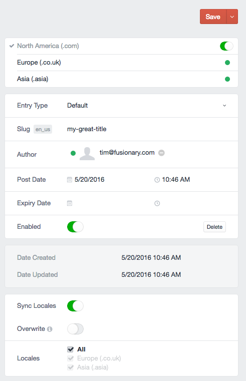

# Locale Sync Plugin for Craft CMS

Sync content to other locales on element save.

## Installation

- Via Composer: `composer require timkelty/craft-elementoptions`
- Download: Unzip to `craft/plugins/localesync`

Locale Sync works on Craft 2.4.x and Craft 2.5.x.

## Why

Craft copies content to all locales on the first save, but after that all content is independent. Authors may want to have some content that stays in sync, or the option to overwrite all content with the current locale.

## What does it do?

Locale Sync allows you to copy content from the current locale when saving an element. Which locales to copy to is configurable. With entries, these settings can be changed per-entry, on the edit screen*. By default, only identical content will be synced, but there is an `overwrite` option to copy all content from the current locale.

\* Entry overrides currently to not work in the entry HUD. Defaults from the plugin settings will be used.

## Configuring Locale Sync

## Roadmap

* Work with Matrix fields #1
* Implement element settings as a fieldtype #3

Brought to you by [Tim Kelty](http://fusionary.com/)
